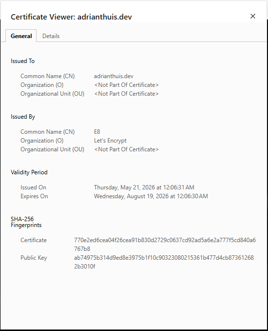
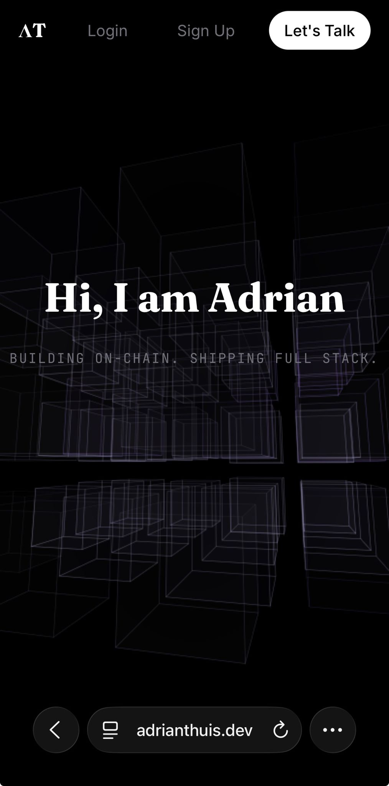

# 🚀 Portfolio & Blog Platform

<div align="center">


**A modern full-stack portfolio and blog platform with JWT authentication, role-based access control, and a comprehensive testing suite.**

[Features](#-features) • [Quick Start](#-quick-start) • [Components](#-react-components) • [Testing](#-testing) • [Tech Stack](#-tech-stack)

</div>

---

## ✨ Features

### 🔐 Authentication & Authorization
- JWT-based authentication with server-side session validation (`/api/auth/me`)
- Role-based access control enforced at API level
- Rate-limited auth endpoints (brute-force protection)
- Auto-logout on expired tokens

### 📝 Blog Management
- Create, read, update, and delete blog posts
- Author attribution and timestamps
- Admin dashboard with modal-based editing

### 👥 User Management
- User registration and login
- Profile page
- Admin user oversight
- Secure credential storage

### 📧 Contact Form
- EmailJS integration
- Direct email delivery without backend dependency
- Loading states and user feedback

### 🎨 Modern UI/UX
- Responsive design
- TailwindCSS v4 styling
- Smooth animations with Framer Motion
- Dark theme interface

### ✅ Comprehensive Testing
- Backend unit tests with Jest & Supertest
- Frontend component tests with React Testing Library
- End-to-end tests with Selenium WebDriver

---

## 🚀 Quick Start

### Prerequisites

- **Node.js** (v18 or higher)
- **PostgreSQL** (v14 or higher)
- **Chrome Browser** (for E2E tests)

### Installation

```bash
# 1. Clone the repository

# 2. Install dependencies
cd server 
npm run install:all

# 3. Create your PostgreSQL database
# In pgAdmin or psql:
# CREATE DATABASE your_database_name;

# 4. Setup environment variables
cp example.env .env
# Edit .env with your credentials

# 5. Setup EmailJS for contact form (optional)
# Create .env in client/ with:
# VITE_EMAILJS_SERVICE_ID=your_service_id
# VITE_EMAILJS_TEMPLATE_ID=your_template_id
# VITE_EMAILJS_PUBLIC_KEY=your_public_key

# 6. Initialize & seed database
# Make sure ADMIN_* variables are set in .env first!
npm run db:init
npm run db:seed

# 7. Start the application
cd ../client
npm run dev
```

Open `http://localhost:3001`

### Production

```bash
cd server
npm run build:frontend
npm run prod
```

Open `http://localhost:3000`

---

## 🔑 Default Accounts

For local development, set admin credentials in your `server/.env`:

```env
ADMIN_USERNAME=your_admin
ADMIN_PASSWORD=your_password
```

A regular test user is also seeded:

| Role | Username | Password |
|------|----------|----------|
| User | `testuser` | `user123` |

> ⚠️ Admin credentials are loaded from environment variables — never hardcode them.

---

## 🧩 React Components

### Core Components

| Component | Purpose | Backend Interaction |
|-----------|---------|---------------------|
| **`BlogCard`** | Presentational card displaying blog title, preview, image, and date | None (receives props) |
| **`ProjectCard`** | Showcases portfolio projects with tech stack and links | None (static data) |
| **`Navigation`** | Top navigation bar with auth-aware links | Uses `useAuth` context |
| **`Header` / `Footer`** | Layout components | None |
| **`BlogModal`** | Create/Edit blog modal — dynamically switches mode based on `blog` prop (null = Create, Blog = Edit) | Submits to `POST /api/blogs` or `PUT /api/blogs/:id` |
| **`UserModal`** | Edit user information (name, email) | Submits to `PUT /api/users/:id` |

### Page Components

| Page | Route | Backend Interaction |
|------|-------|---------------------|
| **`Home`** | `/` | Fetches blogs via `GET /api/blogs` |
| **`Blogs`** | `/blogs` | Lists all blogs via `GET /api/blogs` |
| **`SingleBlog`** | `/blogs/:id` | Fetches one blog via `GET /api/blogs/:id` |
| **`Login`** | `/login` | Calls `POST /api/auth/login` via AuthProvider |
| **`SignUp`** | `/create-account` | Calls `POST /api/auth/create-account` |
| **`Profile`** | `/profile` | Displays current user from AuthProvider |
| **`AdminDashboard`** | `/admin-dash` | CRUD for blogs/users — calls all `GET`, `POST`, `PUT`, `DELETE` endpoints |
| **`Contact`** | `/contact` | Sends email directly via EmailJS (no backend) |

### Routing & Guards

| Component | Purpose |
|-----------|---------|
| **`PrivateRouter`** | Protects admin-only routes — redirects non-admins to `/404` and unauthenticated users to `/login` |
| **`ProtectedRoutes`** | Protects authenticated routes — redirects unauthenticated users to `/login` |

### Context

- **`AuthProvider`** — Global authentication state. Exposes `user`, `isLoggedIn`, `isAdmin`, `login`, `register`, `logout`. Persists JWT token and user data in localStorage.

---

## 🔗 Frontend ↔ Backend Communication

All API calls flow through dedicated service files in `client/src/api/`:

```
┌─────────────────────────────────────────────────┐
│  React Component (e.g., AdminDashboard)         │
│  - Calls api function (e.g., createBlog())      │
└──────────────────┬──────────────────────────────┘
                   │
┌──────────────────▼──────────────────────────────┐
│  API Service (client/src/api/blogs.ts)          │
│  - Wraps Axios call                             │
│  - Adds JWT token from localStorage             │
└──────────────────┬──────────────────────────────┘
                   │ HTTP/JSON
┌──────────────────▼──────────────────────────────┐
│  Express Route (server/routes/blogsRouter.js)   │
│  - Validates input                              │
│  - Passes through checkAuth middleware          │
└──────────────────┬──────────────────────────────┘
                   │
┌──────────────────▼──────────────────────────────┐
│  Controller (server/controllers/auth.js)        │
│  - Business logic                               │
└──────────────────┬──────────────────────────────┘
                   │
┌──────────────────▼──────────────────────────────┐
│  Queries (server/db/blogQueries.js)             │
│  - Parameterized SQL                            │
└──────────────────┬──────────────────────────────┘
                   │
┌──────────────────▼──────────────────────────────┐
│  PostgreSQL Database                            │
└─────────────────────────────────────────────────┘
```

---

## 🧪 Testing

This project includes **three layers of testing** for maximum reliability.

### 🚀 Run All Tests at Once

From the project root, run every test suite (backend + frontend + e2e) sequentially:

```bash
npm test
```

> ⚠️ E2E tests require the server and client to be running. Use `npm run dev` in the `client/` folder first.

Or run them individually:

```bash
npm run test:backend    # Backend unit tests only
npm run test:frontend   # Frontend component tests only
npm run test:e2e        # End-to-end tests only
```

---

### 1️⃣ Backend Unit Tests (Jest + Supertest) — 46 tests

Tests Express routes with mocked database calls to ensure isolated, fast test execution.

**Location:** `server/__tests__/`

```bash
cd server
npm test
```

**Coverage:**
- ✅ `auth.test.js` — Login, registration, validation, error cases
- ✅ `blogs.test.js` — Full CRUD with auth middleware checks
- ✅ `users.test.js` — Full CRUD with auth middleware checks

**Tested scenarios:** Happy paths, missing fields (400), unauthorized access (401), not found (404), and server errors (500).

### 2️⃣ Frontend Component Tests (Jest + React Testing Library) — 18 tests

Tests React components in isolation with mocked dependencies.

**Location:** `client/__tests__/`

```bash
cd client
npm test
```

**Coverage:**
- ✅ `blogCard.test.tsx` — Rendering and link routing
- ✅ `login.test.tsx` — Form rendering, submission, error handling
- ✅ `adminDashboard.test.tsx` — Data fetching, delete actions, modal opening
- ✅ `privateRouter.test.tsx` — Admin-only route protection
- ✅ `protectedRouter.test.tsx` — Authenticated route protection

### 3️⃣ End-to-End Tests (Selenium WebDriver + Jest) — 7 tests

Tests complete user flows in a real Chrome browser, with Jest assertions and lifecycle hooks.

**Location:** `e2e/`

```bash
# Make sure server and client are running first!
cd e2e
npm test
# or
npm run test:selenium
```

**Tested user flows:**
- ✅ Authentication — valid login, invalid credentials, logout
- ✅ Navigation — blogs page, protected route redirect
- ✅ Contact Form — fill and submit with alert handling
- ✅ Admin Blog Creation — login → dashboard → create blog → verify in DOM

### 🧰 Manual API Testing (Postman)

A Postman collection is included for manual API testing.

**File:** `postman_collection.json` (project root)

**How to use:**
1. Import `postman_collection.json` into Postman
2. The collection includes pre-configured variables (`baseUrl`, `token`)
3. The `Login` requests automatically save the JWT to the `{{token}}` variable via a post-response script
4. All protected routes use `{{token}}` in their Bearer Auth header

**Endpoints covered:**
- Auth: `POST /api/auth/create-account`, `POST /api/auth/login`
- Users: `GET`, `POST`, `PUT`, `DELETE` on `/api/users`
- Blogs: `GET`, `POST`, `PUT`, `DELETE` on `/api/blogs`

### Test Stack Summary

| Layer | Tools |
|-------|-------|
| Backend Unit | Jest, Supertest |
| Frontend Unit | Jest, React Testing Library, jest-dom, user-event |
| E2E | Selenium WebDriver, ChromeDriver, Jest |
| Manual API | Postman |
| Mocking | `jest.mock()`, `mockResolvedValue`, `mockRejectedValue` |

---


## 🛠️ Tech Stack

| Layer | Technologies |
|-------|-------------|
| **Frontend** | React 19, TypeScript, Vite, TailwindCSS v4, React Router v7, Axios, Framer Motion, EmailJS |
| **Backend** | Node.js, Express 5, PostgreSQL, JWT, bcrypt, Helmet, express-rate-limit, validator |
| **Testing** | Jest, Supertest, React Testing Library, Selenium WebDriver, Babel |

---

## 📖 Usage

### For Users

1. **Sign Up** at `/create-account`
2. **Login** at `/login`
3. **Browse Blogs** at `/blogs`
4. **View Profile** at `/profile`
5. **Contact** via the contact form

### For Admins

1. Login with admin credentials
2. Navigate to Profile → click **Admin Dashboard**
3. Manage users and blog posts via modals

---

## 🏗️ Architecture

```
┌──────────────────────────────────────────┐
│           React Frontend                 │
│  Vite + TypeScript + TailwindCSS         │
└──────────────────┬───────────────────────┘
                   │ HTTP/REST + JWT Token
┌──────────────────▼───────────────────────┐
│           Express Backend                │
│  JWT Middleware + Controllers + Routes   │
└──────────────────┬───────────────────────┘
                   │ SQL Queries
┌──────────────────▼───────────────────────┐
│          PostgreSQL Database             │
│       Users Table + Blog Table           │
└──────────────────────────────────────────┘
```

---

## 🌐 Deployment

**Live:** [https://adrianthuis.dev](https://adrianthuis.dev)

### Infrastructure

| Component | Technology |
|-----------|-----------|
| **Cloud** | AWS EC2 (Ubuntu 26.04 LTS, t3.micro) |
| **Web Server** | Nginx (reverse proxy + static file serving) |
| **Process Manager** | PM2 (auto-restart + boot persistence) |
| **SSL** | Let's Encrypt via Certbot (auto-renewal) |
| **Domain** | adrianthuis.dev (Porkbun) |

### Traffic Flow

```
Internet
    ↓
Nginx (Port 443 / HTTPS)
    ├── /*       →  React dist/ (static files)
    └── /api/*   →  Express :3000 (managed by PM2)
```

### Deployment Steps

1. Launch EC2 instance with Elastic IP (Ubuntu 26.04 LTS)
2. Create non-root user and configure SSH key-based auth
3. Install Node.js via NVM, Git, PostgreSQL, Nginx, PM2
4. Clone repository and run `npm run install:all`
5. Configure `server/.env` and `client/.env`
6. Initialize and seed database: `npm run db:init && npm run db:seed`
7. Build React frontend: `npm run build:frontend`
8. Configure Nginx as reverse proxy for `/api` and static files
9. Start Express with PM2: `pm2 start index.js && pm2 startup && pm2 save`
10. Point domain DNS A Record to Elastic IP
11. Issue SSL certificate: `sudo certbot --nginx -d adrianthuis.dev`

### Post-Deployment Testing

| Test | Result |
|------|--------|
| SSL Certificate | ✅ Let's Encrypt, valid until Aug 2026 |
| Mobile | ✅ Responsive on Android/iOS |




### Security Hardening

- SSH restricted to trusted IP only (AWS Security Group)
- Password-based SSH authentication disabled
- PostgreSQL not exposed to public internet
- HTTPS enforced — HTTP redirects to HTTPS via Nginx

---

## 🔒 Security

- ✅ Passwords hashed with **bcrypt** (salt rounds: 10)
- ✅ **JWT tokens** for stateless authentication with `/api/auth/me` session validation
- ✅ **Role-based access control** enforced server-side via `requireAdmin` middleware
- ✅ **Helmet.js** for secure HTTP headers
- ✅ **CORS** restricted to configured origin only
- ✅ **Rate limiting** on auth routes (10 requests / 15 min)
- ✅ **Input validation** on all user inputs
- ✅ **SQL injection prevention** via parameterized queries
- ✅ **Password hashes sanitized** from all API responses
- ✅ **Author attribution** from JWT (not client-trusted)
- ✅ **Generic auth errors** prevent user enumeration
- ✅ **Auto-logout** on 401 via Axios interceptor

---

## 📝 Environment Variables

### Server `.env` (in `server/`)

```env
# PostgreSQL
USER=postgres
HOST=localhost
DATABASE=your_database
PASSWORD=your_password
DB_PORT=5432

# CORS
CLIENT_ORIGIN=http://localhost:5173

PORT=3000

# JWT
JWT_SECRET=your_super_secret_key_here

# Admin Seed User
ADMIN_USERNAME=your_admin_username
ADMIN_NAME=Your Name
ADMIN_EMAIL=your@email.com
ADMIN_PASSWORD=your_secure_password
```

### Client `.env` (in `client/`)

```env
# EmailJS (optional, for contact form)
VITE_EMAILJS_SERVICE_ID=your_service_id
VITE_EMAILJS_TEMPLATE_ID=your_template_id
VITE_EMAILJS_PUBLIC_KEY=your_public_key
```

> 💡 Generate a secure JWT secret with `openssl rand -base64 32`

---

## 🐛 Troubleshooting

<details>
<summary><b>Login returns 401 Unauthorized</b></summary>

```bash
cd server
npm run db:init
npm run db:seed
```
This resets the database with fresh hashed credentials.
</details>

<details>
<summary><b>Database connection failed</b></summary>

- Make sure PostgreSQL is running
- Double-check your `.env` credentials
- Ensure the database exists: `CREATE DATABASE your_database;`
</details>

<details>
<summary><b>E2E tests fail with "Element not found"</b></summary>

- Make sure both server and client are running
- Check that the admin user can log in manually first
- Verify the URLs in `e2e.test.js` match your local setup
</details>

---

## 👨‍💻 Developer

**Adrian Thuis**

[](https://github.com/thuisdev)
[](https://x.com/thuisdev)
[](https://www.linkedin.com/in/adrian-t-3b64172a4/)

---

<div align="center">

**Built by Adrian Thuis**

</div>
